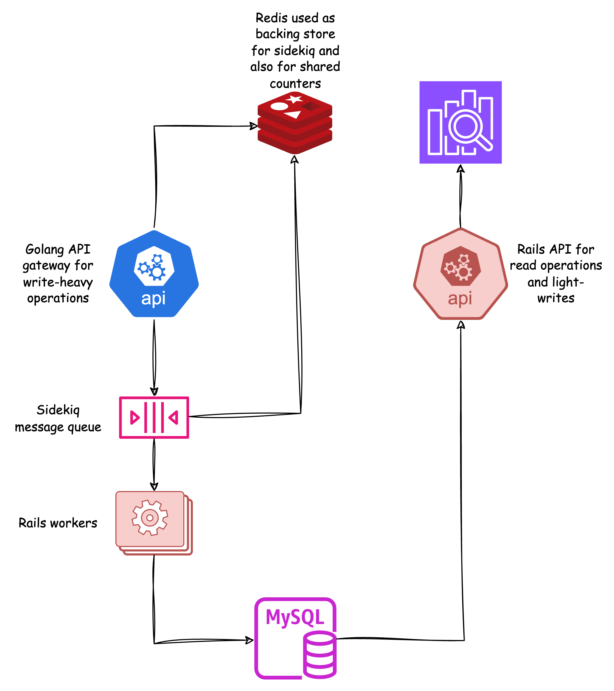

# ChatBug

## Table of Contents

1. [Description](#description)
2. [Architecture](#architecture)
3. [How to Run](#how-to-run)
   - [Prerequisites](#prerequisites)
   - [Steps](#steps)
4. [API Documentation](#api-documentation)

## Description

ChatBug is a RESTful API for creating applications, chats, and messages

## Architecture


The architecture of ChatBug is designed to have a lightweight API gateway using Go, that enqueues write and update requests to sidekiq, where rails workers are waiting to do their job, there are also cron jobs that update `chats_counter` for `applications` and `messages_counter` for `chats`, these crons run every `5 minutes` but they update only the counter that haven't been updated for `55 minutes` or more.

## How to Run

### Prerequisites

- Docker
- Docker Compose

### Steps

1. **Clone the Repository**

   ```bash
   git clone https://github.com/mohieey/chatbug.git
   cd chatbug
   ```

2. **Run with Docker Compose**

   ```bash
   docker-compose up
   ```

3. **Access the Application**

   - The Rail API for sign in/up, application creation, indexing apps, chats and messages, and searching messages bodies can be accessed at `http://localhost:3000`.
   - The Go APIs for chats and messages creation and update can be accessed at `http://localhost:3001`.

## API Documentation

The ChatBug API is documented using Postman. To view the API documentation, go to [https://www.postman.com/joint-operations-administrator-39879654/workspace/puplic/folder/28512739-6f01e3ee-9103-423a-8c7f-2302e072c1cc](https://www.postman.com/joint-operations-administrator-39879654/workspace/puplic/folder/28512739-6f01e3ee-9103-423a-8c7f-2302e072c1cc).

---
